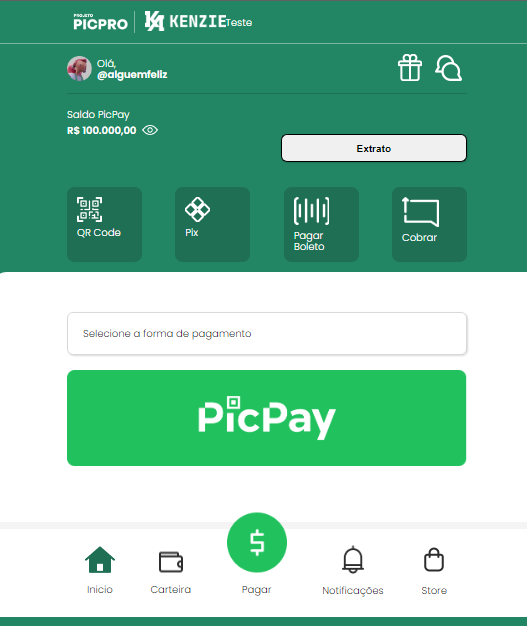

# Projeto PicPro

Ministrado por Kenzie Academy, em parceria com a PicPay, esse projeto foi desenvolvido ao longo do evento PicPro, o qual permitiu a criação de uma página Web do inicio ao fim.

## Linguagens Utilizadas:
- HTML, 
- CSS e 
- Java Script.

##  💻 Contato

https://www.linkedin.com/in/cristiemim9

 ### 🎉 Agradecimentos 

_"Gratidão à todos que participaram do evento e dedicaram seu tempo para formação de novos profissionais."_
